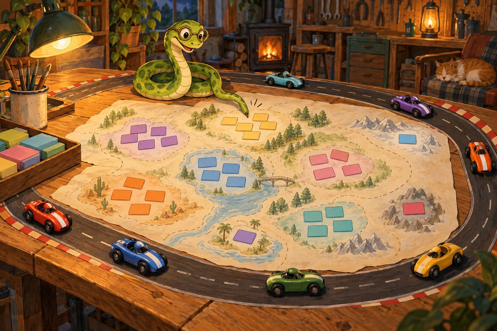

9 de octubre de 2026

# La carrera de los embeddings

## Qué es un embedding

Un embedding es una dirección en un mapa para una frase.

Una computadora no entiende lo que dice una frase. Un motor de embeddings la lee y la convierte en una lista larga de números. Esa lista es su dirección: un lugar en un mapa enorme.

Lo importante es esto: frases que hablan de lo mismo caen cerca, y frases que no tienen nada que ver caen lejos. "El gato duerme" y "el felino descansa" quedan vecinas. "El gato duerme" y "la factura venció" quedan lejos.

Con ese mapa se puede buscar por sentido y no solo por palabras, juntar frases parecidas y ver qué temas tiene un texto grande. Para eso se usa aquí.

Hay muchos motores que hacen ese mapa. Cada uno dibuja el suyo, con otro tamaño de lista de números y otro criterio. La pregunta de esta carrera: cuál dibuja el mejor mapa.

## La carrera

La prueba fue con Macbeth, la obra de Shakespeare, cortada en 1.108 frases. Se le pidió a cada motor la dirección de cada frase y con ellas se armaron grupos de frases vecinas. Después se comparó con lo que ya sabíamos: de qué escena viene cada frase. La obra tiene 28 escenas. Un buen mapa debería juntar las frases de una misma escena.

Corrieron siete motores: Nemotron, Perplexity, Qwen, OpenAI, Voyage 4, Voyage 4 Lite y Liquid. De los tres Voyage, la tabla muestra solo Voyage 4 Large, el más grande.

## Los cinco criterios

Todos miden lo mismo desde un ángulo distinto: qué tan bien el mapa recuerda de qué escena viene cada frase.

**Pureza.** Se mira cada grupo y se cuenta cuántas de sus frases son de la escena que más abunda en él. Si un grupo tiene diez frases y siete son de la misma escena, ese grupo es bastante puro. Más alto, mejor.

**Rand ajustado.** Se toman parejas de frases y se pregunta: ¿el motor las puso juntas cuando son de la misma escena, y separadas cuando son de escenas distintas? Luego se descuenta lo que habría salido de pura suerte. Cero quiere decir "como tirar una moneda". Más alto, mejor.

**Vecino de la misma escena.** Para cada frase se busca la frase más cercana y se mira si es de la misma escena. Es la prueba más directa: ¿el vecino de la puerta de al lado vive en tu casa?

**Vecino equilibrado.** Es el mismo vecino, pero dando a cada escena el mismo peso. Sin eso, las escenas largas ganan siempre porque tienen más frases con quién parearse. Aquí las escenas cortas valen igual que las largas.

**Pureza equilibrada.** Es la pureza, también con el mismo peso para cada escena, para que las largas no tapen a las cortas.

## Los resultados

Cada número es el porcentaje de aciertos, redondeado. El más alto de cada columna va en negrita.

| Motor | Pureza | Vecino | Vecino equilibrado | Pureza equilibrada |
|---|---:|---:|---:|---:|
| **Nemotron** | **18** | 25 | 19 | **10** |
| Perplexity | 17 | 25 | 18 | 8 |
| OpenAI | 16 | 25 | 19 | 8 |
| Liquid | 16 | 23 | 17 | 8 |
| Voyage 4 Large | 14 | **30** | **24** | 6 |
| Qwen | 15 | 25 | 18 | 8 |
| Gemini Embedding 001 | **18** | 29 | 22 | 9 |

En el Rand ajustado todos quedaron cerca de cero; Gemini quedó apenas por encima de Nemotron, por un margen mínimo.

Nemotron ganó los cinco criterios en la primera ronda. Perplexity quedó segundo en tres de ellos. Qwen, que costó más y usa listas de números más largas, no le ganó a Perplexity en el duelo directo, y quedó atrás.

## Lo que dicen los números

Primero, la diferencia entre motores es pequeña. Casi todos aciertan un vecino de cada cuatro, y ninguno pasa de uno de cada cinco en pureza. Es poco: Macbeth no se deja separar bien por escenas, y eso no es culpa de los motores. Una escena sobre el sueño puede tener frases muy parecidas a las de otra escena, y el criterio las cuenta como error aunque tengan sentido juntas.

Segundo, estas medidas dicen qué motor separa mejor las escenas. No dicen cuál entiende mejor la poesía, ni cuál es más bello.

Tercero, el precio no decidió nada. Nemotron es gratis. Perplexity cuesta menos de una centésima de centavo por la obra completa.

## Los que llegaron después

**Voyage 4 Large** llegó después, con la obra completa. Le gana los dos vecinos a todos.

**Gemini Embedding 001** llegó último por tiempo: completó la obra después, con la cuota del día. Contra el campeón, gana cuatro de cinco; el campeón conserva pureza equilibrada. Los márgenes fueron pequeños.

Con tanta cercanía no hay un campeón absoluto. Hay uno que anduvo más seguido adelante: Nemotron.

## Para llevarse

Un embedding es una dirección para una frase en un mapa de significados. La carrera midió qué tan bien cada motor agrupa por escena. Ganó Nemotron por poco, y es gratis. Todos quedaron lejos de lo perfecto, y la obra misma explica gran parte.
